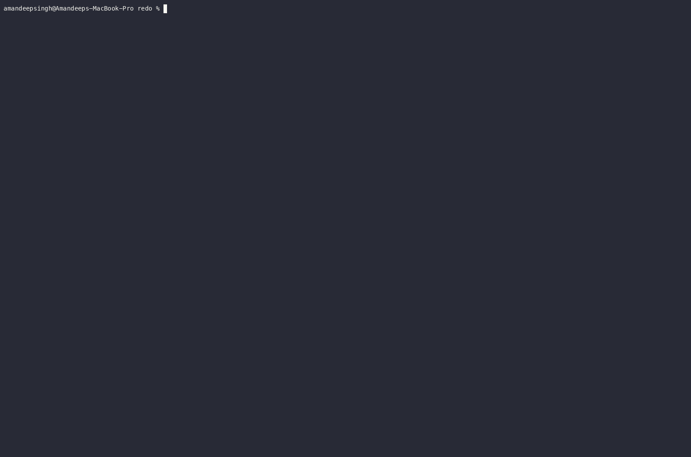

# redo

[](https://github.com/aman751997/redo/actions/workflows/ci.yml)
[](LICENSE)

> Time-travel debugger for LLM agent sessions.

`redo` records every state transition inside a Claude Code session — tool calls, model outputs, file writes — into a seekable, content-addressed binary log. From that log you can scrub to any frame, fork into a new session, and diff two runs at the structural level.

Closest analogy: Mozilla's [`rr`](https://rr-project.org/), but for non-deterministic agentic systems instead of native binaries.



## Why

Every agent tool ships tracing. None ship replay. Tracing tells you *what happened*. Replay lets you *go back and look*.

`redo` is **not** an undo button — Claude Code's own `/rewind` covers that. `redo` is for the questions `/rewind` cannot answer: *why* a run failed two days ago, *whether* the same failure shape happened to someone else, and *how* this run drifts from a reference trajectory.

See [`docs/WHY.md`](./docs/WHY.md) for the full thesis.

## How it works

Three design decisions carry most of the weight:

1. **Record model outputs, never re-infer.** On replay the "model call" is a lookup, not an API call.
2. **Framed binary log with a seek index.** Zstd with a trained dictionary gets ~12× compression on real traces.
3. **Content-addressed filesystem snapshots.** Userspace CoW via blake3 Merkle trees — cross-platform, dedup-for-free.

See [`docs/HOW.md`](./docs/HOW.md) for the full architecture walk-through.

## Quick start

### Prerequisites

- [Rust toolchain](https://rustup.rs/) (1.75+)
- [Claude Code](https://docs.anthropic.com/en/docs/claude-code) installed and working

### Install

```bash
git clone https://github.com/aman751997/redo.git
cd redo
cargo install --path .
```

Or skip the install and run from the repo: use `cargo run --release --` in place of `redo` in every command below.

### 1. Start recording (Terminal 1)

Open a terminal and start the recorder:

```bash
redo record
```

It prints a banner like this:

```
session_id=018f2a5b-...
session_dir=/Users/you/.local/share/redo/sessions/018f2a5b-...
dropbox=/Users/you/.local/share/redo/sessions/018f2a5b-.../dropbox
env REDO_SESSION_DIR=/Users/you/.local/share/redo/sessions/018f2a5b-...
```

Leave this running — the recorder captures events until you press `Ctrl-C`.

### 2. Wire Claude Code hooks (Terminal 2)

In a **second terminal**, export the session dir printed by the recorder:

```bash
export REDO_SESSION_DIR=/Users/you/.local/share/redo/sessions/018f2a5b-...
```

Add hooks to your Claude Code config (`~/.claude/settings.json`):

```json
{
  "hooks": {
    "PreToolUse": [{ "type": "command", "command": "redo hook PreToolUse" }],
    "PostToolUse": [{ "type": "command", "command": "redo hook PostToolUse" }],
    "UserPromptSubmit": [{ "type": "command", "command": "redo hook UserPromptSubmit" }],
    "Stop": [{ "type": "command", "command": "redo hook Stop" }],
    "Notification": [{ "type": "command", "command": "redo hook Notification" }]
  }
}
```

Now run Claude Code from this terminal. Every tool call, prompt, and file write flows through the hooks into the recorder.

Smoke test (without Claude Code):
```bash
printf '%s' '{"tool_name":"Bash","output":"hello\n"}' | redo hook PostToolUse
```

### 3. Stop recording, then explore

Press `Ctrl-C` in Terminal 1 to stop the recorder. Then:

```bash
redo list                       # table of all sessions
redo inspect <SESSION_ID>       # dump frames as NDJSON
redo replay  <SESSION_ID>       # scrubbable TUI
```

**TUI keys:** `j`/`k` step, `J`/`K` jump spans, `g`/`G` first/last, `0`–`9` decile jump, `f` fork, `d` diff, `/` filter, `q` quit.

### 4. Fork and diff

```bash
redo fork <SESSION_ID> --at 42 --label experiment
redo diff <SESSION_A> <SESSION_B> --context 5
```

Fork branches a session at any frame — the new session is a standalone recording. Diff compares two sessions via Myers diff over canonical projections.

Inside `redo replay`: press `f` to fork at cursor, `d` to open side-by-side diff view.

## What v0.1 captures

| Event | Source | What's recorded |
|---|---|---|
| `Marker` | Every Claude Code hook | Verbatim payload in `extras` |
| `Output` | `PostToolUse[Bash]` | stdout (or stderr fallback), tagged `extras.source = "bash"` |
| `FileWrite` | `PostToolUse[Edit\|Write\|MultiEdit]` | blake3 hash + size + inline bytes (≤ 256 KiB) |

**Not yet captured:** model reasoning tokens, network state from `Bash` subprocesses, syscall-level clock/randomness.

When Claude Code changes a hook payload shape, the recorder logs a warning and bumps `Meta.schema_drift_events`.

## Platform

Targets macOS. Linux `inotify` path compiles but is not the primary target yet.

## Status

Current: span grouping, scrub bar, fork-from-frame, text-level diff. Next up: content-addressed filesystem snapshots.

- [`CHANGELOG.md`](./CHANGELOG.md) — what shipped
- [`docs/ROADMAP.md`](./docs/ROADMAP.md) — what's next

## Docs

- [`docs/WHY.md`](./docs/WHY.md) — origin story and thesis
- [`docs/HOW.md`](./docs/HOW.md) — architecture and design decisions
- [`docs/ROADMAP.md`](./docs/ROADMAP.md) — what's next

## Contributing

Issues and PRs welcome. The project is early — if something is broken or unclear, open an issue.

## License

[MIT](LICENSE)
